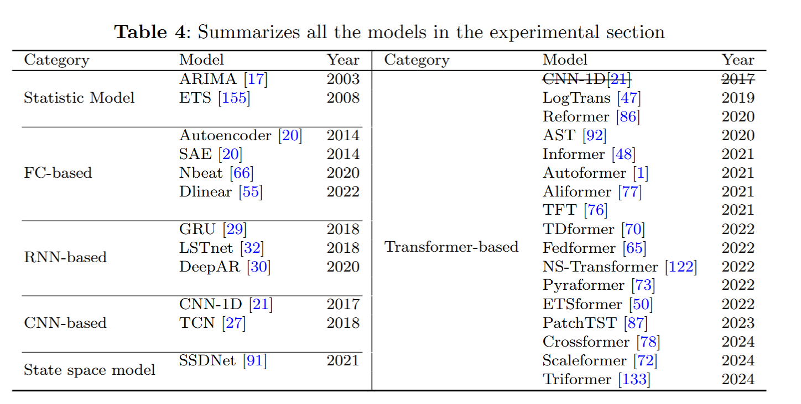
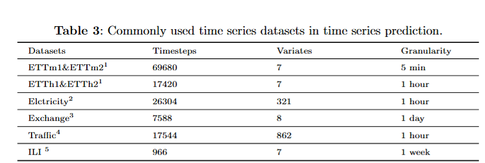

# A Survey: Deep Learning-based Time Series Forecasting 

A official pytorch implementation for the paper: ' *Deep Learning-based Time Series Forecasting*'  Xiaobao Song, Liwei Deng,Hao Wang\*, Yaoan Zhang, Yuxin He and Wenming Cao (\*Correspondence) [PDF](https://doi.org/10.1007/s10462-024-10989-8)

# 🎯Introduction


# 📚Model Statics 



❗️❗️❗️Tips: Due to our carelessness, we incorrectly reclassified the **CNN-1D** model to the Transformer-based category in the paper. We sincerely apologize for this mistake.

The following are the baseline models included in this project (continuously updated):

- ARIMA [PDF](https://ieeexplore.ieee.org/abstract/document/1216141) (IEEE Transactions on Power Systems 2003)
- ETS [PDF](https://www.jstatsoft.org/index.php/jss/article/view/v027i03/255)  (Journal of statistical software 2008)
- Autoencoder [PDF](https://ieeexplore.ieee.org/stamp/stamp.jsp?tp=&arnumber=6894591)  (Neurocomputing 2014)
- SAE   [PDF](https://ieeexplore.ieee.org/stamp/stamp.jsp?tp=&arnumber=6894591)  (IEEE Transactions on Intelligent Transportation Systems 2014)
- CNN-1D [PDF](https://ieeexplore.ieee.org/stamp/stamp.jsp?tp=&arnumber=8285188)  (IEEE Symposium Series on Computational Intelligence 2017)
- TCN [PDF](https://arxiv.org/pdf/1803.01271) [Code](http://github.com/locuslab/TCN)  (ArXiv 2018)
- GRU [PDF](https://ieeexplore.ieee.org/stamp/stamp.jsp?tp=&arnumber=8053243)  (Artificial Neural Networks and Machine Learning–ICANN 2018)
- Nbeat [PDF](https://openreview.net/pdf?id=r1ecqn4YwB)  (Journal of biomedical informatics 2020)
- LSTnet [PDF](https://arxiv.org/pdf/1703.07015) [Code](https://github.com/laiguokun/multivariate-time-series-data?tab=readme-ov-file)  (ACM SIGIR 2018)
- LogTrans [PDF](https://proceedings.neurips.cc/paper_files/paper/2019/file/6775a0635c302542da2c32aa19d86be0-Paper.pdf)  (NIPS 2019)
- DeepAR [PDF](https://arxiv.org/pdf/1704.04110)  (NIPS 2020)
- AST [PDF](https://proceedings.neurips.cc/paper/2020/file/c6b8c8d762da15fa8dbbdfb6baf9e260-Paper.pdf) [Code](https://github.com/hihihihiwsf/AST)  (NIPS 2020)
- Reformer [PDF](https://openreview.net/pdf?id=rkgNKkHtvB)  (ICLR 2020)
- SSDNet [PDF](https://ieeexplore.ieee.org/stamp/stamp.jsp?tp=&arnumber=9679135)  (IEEE International Conference on Data Mining2021)
- Informer [PDF](https://arxiv.org/pdf/2012.07436) [Code](https://github.com/zhouhaoyi/Informer2020)  (AAAl 2021)
- Autoformer [PDF](http://proceedings.neurips.cc/paper/2021/file/bcc0d400288793e8bdcd7c19a8ac0c2b-Paper.pdf) [Code](https://github.com/thuml/autoformer)  (NlPS 2021)
- Aliformer [PDF](https://arxiv.org/pdf/2109.08381)  (ArXiv 2021)
- TST [PDF](https://arxiv.org/pdf/1912.09363v3.pdf) [Code](https://github.com/google-research/google-research/tree/master/tft)  (ArXiv 2021)
- TDformer [PDF](https://arxiv.org/pdf/2212.08151) [Code](https://github.com/BeBeYourLove/TDformer)  (ArXiv 2022)
- Dlinear [PDF](https://arxiv.org/pdf/1912.10077)  (AAAl 2022)
- Fedformer [PDF](https://arxiv.org/pdf/2201.12740v3.pdf) [Code](https://github.com/MAZiqing/FEDformer)  (lCML 2022)
- NS-Transformer [PDF](https://arxiv.org/pdf/2205.14415v4.pdf) [Code](https://github.com/thuml/Nonstationary_Transformers)  (NIPS 2022)
- Pyraformer [PDF](https://openreview.net/pdf?id=0EXmFzUn5I) [Code](https://github.com/ant-research/Pyraformer)  (ICLR 2022)
- ETSformer [PDF](https://arxiv.org/pdf/2202.01381v2.pdf) [Code](https://github.com/salesforce/etsformer)  (ArXiv 2022)
- PatchTST [PDF](https://arxiv.org/pdf/2211.14730v2.pdf) [Code](https://github.com/yuqinie98/patchtst)  (ICLR 2023)
- Crossformer [PDF](https://arxiv.org/pdf/2108.00154) [Code](https://github.com/thinklab-sjtu/crossformer)  (ICLR 2023)
- Scaleformer [PDF](https://arxiv.org/pdf/2206.04038v4.pdf) [Code](https://github.com/borealisai/scaleformer)  (ICLR 2024)
- Triformer [PDF](https://arxiv.org/pdf/2204.13767)  (ArXiv 2024)
- ......


# 🧾Dataset Statics




# Get Started

<span id='all_catelogue'/>

### Table of Contents:

- <a href='#Install dependecies'>1. Install dependecies</a>
- <a href='#Data Preparation'>2. Data Preparation </a>
- <a href='#Run Experiment'>3. Run Experiment</a>

<span id='Install dependecies'/>

## 📝Install dependecies  <a href='#all_catelogue'>[Back to Top]</a>

Install the required packages

```bash
pip install -r requirements.txt
```

<span id='Data Preparation'/>

# 👉Data Preparation<a href='#all_catelogue'>[Back to Top]</a>

We follow the same setting as previous work. The datasets for all the six benchmarks can be obtained from [[Autoformer](https://github.com/thuml/Autoformer)]. The datasets are placed in the `datasets` folder of our project. The tree structure of the files is as follows:

```
\datasets
├─electricity
│
├─ETT-small
│
├─exchange_rate
│
├─illness
│
└─traffic
```

<span id='Run Experiment'/>

# 🚀Run Experiment<a href='#all_catelogue'>[Back to Top]</a>

We have provided all the experimental scripts for the benchmarks in the `./scripts` folder, which covers all the benchmarking experiments. To reproduce the results, you can run the following shell code.

```bash
 ./scripts/ETTh1.sh
 ./scripts/ETTh2.sh
 ./scripts/ETTm1.sh
 ./scripts/ETTm2.sh
 ./scripts/exchange.sh
 ./scripts/illness.sh
 ./scripts/traffic.sh
```


## 📧Contact

For any questions or feedback, feel free to contact [Xiaobao Song](mailto:2840329517@qq.com) or [Liwei Deng](mailto:liweidengdavid@gmail.com).


# 🌟Citation

If you find this code useful in your research or applications, please kindly cite: 

```
@article{song2024deep,
  title={Deep learning-based time series forecasting},
  author={Song, Xiaobao and Deng, Liwei and Wang, Hao and Zhang, Yaoan and He, Yuxin and Cao, Wenming},
  journal={Artificial Intelligence Review},
  volume={58},
  number={1},
  pages={23},
  year={2024},
  publisher={Springer}
}
```

Song, X., Deng, L., Wang, H. *et al.* Deep learning-based time series forecasting. *Artif Intell Rev* **58**, 23 (2025). https://doi.org/10.1007/s10462-024-10989-8


# 🤝Acknowledgments

We express our gratitude to the following members for their contributions to the project, completed under the guidance of Professor [Hao Wang](https://tccofwang.github.io/index.html):

[Xiaobao Song](https://yumiyumo.github.io/SongXiaobao.github.io/)， [Liwei Deng](https://liweidengdavid.github.io/)，[Yaoan Zhang](mailto:2291149420@qq.com)，[Junhao Tan](http://paradise2200.github.io)，[Hongbo Qiu](https://howardqiuu.github.io)，[Xinhe Niu](https://xinheniu.github.io/)

